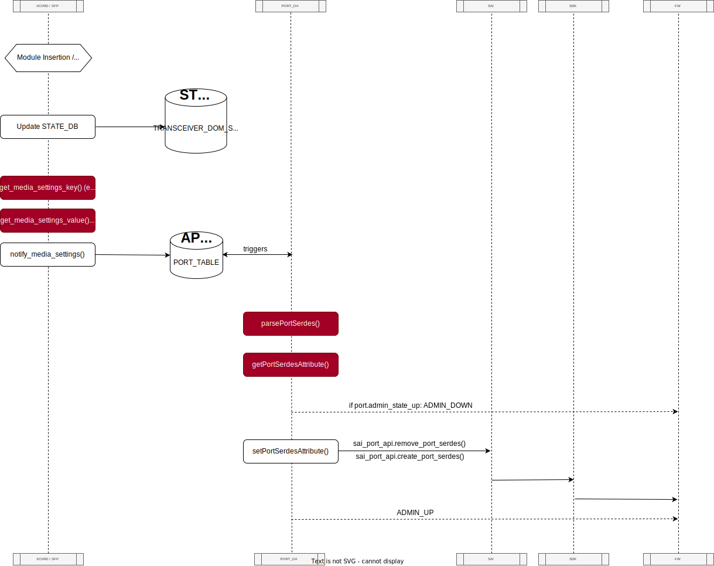

# Feature Name
Port Signal Integrity by Speed </br></br>
# High Level Design Document
#### Rev 0.2

</br>

# Table of Contents
  * [General Information](#general-information)
    * [Revision](#revision)
    * [About This Manual](#about-this-manual)
    * [Definitions/Abbreviations](#definitionsabbreviations)
    * [Reference](#reference)
  * [Feature Motivation](#feature-motivation)
  * [Design](#design)
    * [New SERDES parameters (data)](#new-serdes-parameters-data)
      * [Application DB Enhancements](#application-db-enhancements)
      * [The input](#the-input)
      * [How are we going to use this json?](#how-are-we-going-to-use-this-json)
    * [Port SI configuration (flows)](#port-si-configuration-flows)
  * [Changes to support the new mode](#changes-to-support-the-new-mode)
  * [Unit Test](#unit-test)

</br></br>

# General Information 

## Revision
| Rev |     Date    |       Author       | Change Description                                       |
|:---:|:-----------:|:------------------:|-----------------------------------                       |
| 0.1 | 07/06/2023  | Tomer Shalvi       | Base version                                             |

## About this Manual
This document is the high level design of Independent Module feature for SONiC Nvidia.

## Definitions/Abbreviations
| Term     |     Description                                   |
|:--------:|:-------------------------------------------------:|
| SAI      |     Switch Abstraction Interface                  |
| SONiC    |     Software for Open Networking in the Cloud     |
| CMIS     |     Common Management Interface Specification     |
| MDF      |     Module Detection Flow                         |

## Reference
| Document                                                                                                                                       |     Description                                                  |
|:----------------------------------------------------------------------------------------------------------------------------------------------:|:----------------------------------------------------------------:|
| [Independent module management - SONIC/SAI arch specification](https://confluence.nvidia.com/pages/viewpage.action?pageId=1822392761)          |  SONiC & SAI Independent Module architecture document by Eddy K. |
| [Module management architecture](https://confluence.nvidia.com/pages/viewpage.action?spaceKey=NSWARCH&title=Module+management+architecture)    |     Independent Module Management architecture by Ilya V.        |
| [cmis-init.md](https://github.com/sonic-net/SONiC/blob/master/doc/sfp-cmis/cmis-init.md)                                                       |     CMIS initialization HLD.                                     |
| [Media based port settings in SONiC](https://github.com/sonic-net/SONiC/blob/master/doc/media-settings/Media-based-Port-settings.md)           |     Media based port settings HLD.                               |

</br></br></br></br>


# Feature Motivation


Customers want to have complete flexibility and independence between switch vendors and optical cables.
However, today, if our customers want to have our switches support some module of other vendors, they have to bear long waiting times for a FW release to come out. 
So the goal of this feature is to allow them to take our switches and easily use them interchangeably with other vendors modules, and vice versa.
Hence, a strategic decision has been made to transition the management of CMIS modules from FW to software SW.


</br></br></br></br>


# Design

Currently, the configuration of SerDes SI is done entirely by FW without any involvement of SONiC. However, once we transition to independent mode, SONiC will take over the responsibility of configuring the SerDes. It will achieve this by sending the relevant port SI parameters to FW.</br>
This flow mostly existed before, but was not put into practice because FW was responsible for configuring the SerDes. In the new mode, this flow will be expanded to support the new SI parameters sent to FW and to support the ability to send them based on the relevant lane speed. 
Additionally, as part of working on this entire feature (outside the context of port SI per speed), the synchronization between the configuration of the ASIC and the configuration of the modules will be improved. In the new mode, once the ASIC configuration is complete, a signal will be sent from the FW to indicate that the module configuration can begin.
 </br></br>
 

# New SERDES parameters (data)

## Application DB Enhancements

6 new fields **ob_m2lp**, **ob_alev_out**, **obplev**, **obnlev**, **regn_bfm1p**, **regn_bfm1n** will be added to **PORT_TABLE** table:

```
ob_m2lp             = 1*8HEXDIG *( "," 1*8HEXDIG) ; list of hex values, one per lane              ; ratio between the central eye to the upper and lower eyes (for PAM4 only)
ob_alev_out         = 1*8HEXDIG *( "," 1*8HEXDIG) ; list of hex values, one per lane              ; output common mode
obplev              = 1*8HEXDIG *( "," 1*8HEXDIG) ; list of hex values, one per lane              ; output buffers input to Common mode PMOS side
obnlev              = 1*8HEXDIG *( "," 1*8HEXDIG) ; list of hex values, one per lane              ; output buffers input to Common mode NMOS side
regn_bfm1p          = 1*8HEXDIG *( "," 1*8HEXDIG) ; list of hex values, one per lane              ; voltage regulator to pre output buffer PMOS side
regn_bfm1n          = 1*8HEXDIG *( "," 1*8HEXDIG) ; list of hex values, one per lane              ; voltage regulator to pre output buffer NMOS side
```

Here is the table to map the fields and SAI attributes:

| Parameter     |              sai_port_attr_t                      |
|:-------------:|:-------------------------------------------------:|
| ob_m2lp	      |     SAI_PORT_SERDES_ATTR_TX_PAM4_RATIO            |
| ob_alev_out   |     SAI_PORT_SERDES_ATTR_TX_OUT_COMMON_MODE       |
| obplev        |     SAI_PORT_SERDES_ATTR_TX_PMOS_COMMON_MODE      |
| obnlev        |     SAI_PORT_SERDES_ATTR_TX_NMOS_COMMON_MODE      |
| regn_bfm1p    |     SAI_PORT_SERDES_ATTR_TX_PMOS VLTG_REG         |
| regn_bfm1n    |     SAI_PORT_SERDES_ATTR_TX_NMOS VLTG_REG         |


## The input

SI parameters input comes as an excel file, received from PHY, and structured as follows:


Each pair of platform (NDR, HDR, XDR) and device (4700, 5600) has its own dedicated excel file.</br>
This file contains both SerDes SI parameters and module SI parameters.</br>
To ensure that this data is transmitted properly to SDK, the Excel file will be parsed and transformed into the media_settings.json file.</br>
The media_settings.json file will be located at '/usr/share/sonic/device/[device_type]/media_settings.json' and will follow this format:


## How are we going to use this json?

The flow of using of this json will be referred to as the **_Notify-Media-setting-Process_**:




During the **_Notify-Media-setting-Process_** two things occur:

1. STATE_DB is updated with sfp, dom and pm data.
2. The APP_DB is updated with the connected module SI parameters. This is achieved through the notify_media_settings() function, which uses the pre-parsed media_settings.json file to write its contents to APP_DB: First, a key is composed for performing the JSON lookup, based on the media type, specification compliance, length, and lane speed. Then, the lookup is performed using that key, and the relevant data is extracted from the JSON and stored in APP_DB.

    Before transitioning to independent mode, SERDES SI parameters were never applied because the media_settings.json file was not found on the platform. In the new mode, media_settings.json will be present on every platform, but it will only be utilized when it contains an entry for a plugged-in CMIS module (QSFP-DD, OSFP). If it does not have a suitable entry for the connected module, nothing will be written to APP_DB to maintain backward compatibility with the legacy flow.

    In order for the FW to configure the ASIC in the case of non-CMIS modules, instead of SONiC, it is crucial to ensure that the           media_settings.json file satisfies the following two requirements:
    - The media_settings.json file should only contain data related to CMIS modules. Signal Integrity (SI) parameters for non-CMIS modules should not be present in this JSON file.

    - The media_settings.json file must not include a 'default' section. Normally, the lookup process in the media_settings.json file allows for a default section. SI parameters, defined in this section, will be written to the APP_DB if there is no matching entry found for any other module in the JSON file. However, since we do not intend SONiC configuration to support non-CMIS modules, it is necessary for the media_settings.json file to exclude the default section.

    </br>Ports OrchAgent listens to changes in APP_DB, so when the APP_DB is updated with SI parameters, PortsOrchagent is triggered. Based on the data found in APP_DB, PortsOA creates a vector that contains the SI values for a certain port and passes it as a whole to the SAI. Eventually, they will write it to the SLTP register in PHY upon receiving ADMIN_UP.  
  </br></br></br>


## Port SI configuration (flows)

  
*** Risk: Currently the loading of media_settings.json is skipped in case fast-reboot is enabled. There's an open issue that is under discussion with Microsoft to revert this commit: https://github.com/sonic-net/sonic-platform-daemons/pull/221. 

As described above, passing the port SI parameters is carried out in 3 scenarios:

- Initialization phase: When the switch is going up, the **_Notify-Media-setting-Process_** is carried out for each of the current interfaces. 
- Module Plug in event
- Port speed change event: When there is a speed change (port-breakout for example), it is going to affect the speed per lane </br></br></br></br>


# Changes to support the new mode

1. The XCVRD::Notifty_media_settings() function should be modified to support the new SI parameters and the format of media_settings_json:

   - The method get_media_settings_key() should be extended:

      We need to extend the key used for lookup in the media_settings.json file to include the lane speed as well. Currently, the key is composed of three components: media type, specification compliance, and length.
      In the new format of media_settings.json, the key will consist of four components: media type, specification compliance, length, **<span style="color:red">and lane speed</span>**".
      For example, "QSFP28-40GBASE-CR4-5M" will be transformed to "QSFP28-40GBASE-CR4-5M**<span style="color:red">-50G</span>"**.
      To achieve this, the SFP thread will maintain a dictionary that maps the current speed and number of lanes for each port. The SFP thread will listen for changes in STATE_DB.PORT_TABLE to have updated data.
      When it's time to access the media_settings.json file, the function "notify_media_settings()" will calculate the lane speed for a specific port using the formula: lane_speed = port_speed / number_of_lanes. It will then concatenate this value to the key in the original format.


      ```python
      def get_media_settings_key(port, transceiver_dict):
        ...
        lane_speed = self.port_dict[port]['speed'] / self.port_dict[port]['lanes']
        media_key += '-' + lane_speed
        ...
        return media_key
      ```

    - The method get_media_settings_value() should be modified to enable lookup in the json file for both the extended format keys and the current format keys:

      After calculating the key, the lookup in the media_settings.json file will be performed.
      Initially, the entire key will be used for the lookup. If there is a match, the corresponding values will be fetched and returned.
      However, if there is no match, the SI parameters will be looked up by removing the lane speed component from the key, reverting back to the original format mentioned earlier.
      This approach ensures compatibility with other vendors whose lookup does not depend on the lane speed. By doing so, we ensure that changing the format of the entries within the media_settings.json file does not break code from other vendors.

      
      ```python
      def get_media_settings_value(physical_port, media_key):
        if PORT_MEDIA_SETTINGS_KEY in g_dict:
            for keys in g_dict[PORT_MEDIA_SETTINGS_KEY]:
              if int(keys) == physical_port:
                  media_dict = g_dict[PORT_MEDIA_SETTINGS_KEY][keys]
                  break
      
        if media_key in media_dict:
            return media_dict[media_key]
        old_format_key = media_key.split('-')[:-1]
        if old_format_key in media_dict:
            return media_dict[old_format_key]
        return {}
      ```

2. Changes in SfpStateUpdateTask thread:
  - In independent mode, as mentioned before, we rely on the lane speed when we lookup in media_settings,json. Hence, this flow has to be triggered not only by insertion/removal of modules, but by configuration changes as well (port breakout for example).
      This thread is going to listen to STATE_DB.PORT_TABLE, and when there is a change in port speed, notify_media_settings() will be triggered.
  - We need the thread to have a new member variable to store the speed and number of lanes for each port: port_dict.

  ```python
  class SfpStateUpdateTask(threading.Thread):
 
   def __init__(self, namespaces, port_mapping, main_thread_stop_event, sfp_error_event):  
      self.port_dict = {}
 
   def task_worker(self):
      sel, asic_context = port_mapping.subscribe_port_update_event(self.namespaces, helper_logger)
      while not self.task_stopping_event.is_set():
         port_mapping.handle_port_update_event(sel,
                                               asic_context,
                                               self.task_stopping_event,
                                               helper_logger,
                                               self.on_port_update_event)
      ...
 
 
   def on_port_update_event(self, port_change_event):
      if port_change_event.event_type == port_change_event.PORT_SET:
         if 'speed' in port_change_event.port_dict and port_change_event.port_dict['speed'] != 'N/A':
             self.port_dict[lport]['speed'] = port_change_event.port_dict['speed']
         if 'lanes' in port_change_event.port_dict:
             self.port_dict[lport]['lanes'] = port_change_event.port_dict['lanes']
         notify_media_setting()
  ```


3. Ports OA shall support new SI params: Need to parse data from PORT Table in APP DB and send new attributes via Port SAI API
   doTask(consumer&) is a function that executes only when a certain event occurs. In our case, PortOrch::doTask(consumer&) listens for changes in APP_DB and triggered only after APP_DB is updated (during the execution of notify_media_settings()). After that, SI params need to be transmitted from APP_DB to SAI. This will be done as follows:
    
  ```cpp
void PortsOrch::doPortTask(Consumer &consumer) {
      bool serdes_param_set = false;
      for every operation done on APP_DB{
          if (op == SET_COMMAND){
              ...
              if (fvField(i) == <some_new_SI_param>)
              {
                      serdes_param_set = true;
                      getPortSerdesVal(fvValue(i), attr_val);
                      serdes_attr.insert(serdes_attr_pair(SAI_PORT_SERDES_ATTR_SOME_SI_PARAM, attr_val));
              }
              ...
  
              if(p.m_admin_state_up && serdes_param_set){
                  setPortAdminStatus(port, false)
              }
  
              setPortSerdesAttribute(port, gSwitchId, serdes_attr)
  
              setPortAdminStatus(port, true)
          }
      }
  }
  ```


# Unit Test
- Generation of keys in the new format: Expand the test_get_media_settings_key(self) method to create a dictionary that contains a mapping between a port and its port speed and lane count. Then call get_media_settings_key() with that dictionary and assert that the lane speed was concatenated properly to the key in the current format and composed a valid key in the new format.
- Lookup works with both new format and legacy format keys: Create a new test, test_get_media_settings_value(), that gets a key in the new format and looks it up in two different instances of media_settings.json. If the key cannot be found in the new format, perform a second lookup without the lane_speed. The first lookup will be performed in a JSON file that contains the key in the new format, ensuring a match. The second lookup should be performed on a JSON file that only has data for the trimmed version of the key. There should still be a match, as the functionality of get_media_settings_value() trims the lane_speed from the key if there is no match when using the full key. This test ensures that the new format does not cause any issues for other vendors.
- PortsOrchagent tests:
Verify the SAI object is created properly with the new SI parameters: Create an instance of media_settings.json that contains all new SI parameters for a certain module, call to notify_media_setting() and ensure PortOrchagent creates SAI object that contains all new parameters (reference: https://github.com/sonic-net/sonic-swss/blob/ffce92658da01e8a8f613dc1d89f9b439509d1be/tests/mock_tests/portsorch_ut.cpp#L68C5-L68C50)
